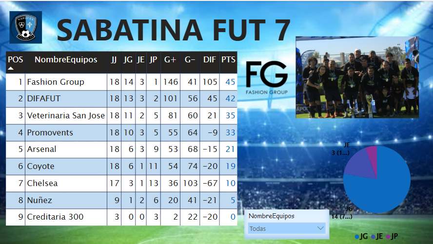

This project is a recollection, management, and analytics system for my Saturday morning soccer team's statistics.

My father records the match data, and I organize it in a MySQL database to later visualize and analyze it using tools like Power BI.
The goal is to gain insights, track player performance (goals, assists, results), and eventually apply machine learning for predictions.

Grafana: http://localhost:3306
-  Usuario: futbol_user
-  Contraseña: futbol_pass

Mi first Visualization update is:
Dashboard in PowerBI
